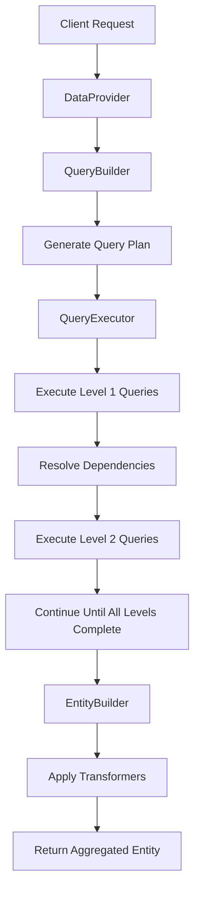

# Schemio Framework - Complete Developer Guide

## Table of Contents
1. [Introduction](#introduction)
2. [The Need for Data Aggregation](#the-need-for-data-aggregation)
3. [Core Concepts](#core-concepts)
4. [Package Overview](#package-overview)
5. [Getting Started](#getting-started)
6. [Architecture Deep Dive](#architecture-deep-dive)
7. [Configuration Guide](#configuration-guide)
8. [Query Implementation Guide](#query-implementation-guide)
9. [Transformer Implementation Guide](#transformer-implementation-guide)
10. [Advanced Features](#advanced-features)
11. [Extension Points](#extension-points)
12. [Best Practices](#best-practices)
13. [Performance Considerations](#performance-considerations)
14. [Troubleshooting](#troubleshooting)
15. [Future Extensions](#future-extensions)

---

## Introduction

**Schemio** is a powerful .NET library designed to aggregate data from heterogeneous data stores using a schema-driven approach. It enables developers to hydrate complex object graphs by fetching data from multiple sources (SQL databases, Web APIs, NoSQL stores) using XPath and JSONPath schema mappings.

### Key Benefits

- **Unified Data Access**: Aggregate data from SQL databases, REST APIs, and custom data sources
- **Schema-Driven**: Use XPath or JSONPath to define object graph mappings
- **Performance Optimized**: Execute queries in parallel with dependency management
- **Extensible**: Easily add support for new data sources
- **Type-Safe**: Strongly-typed entities and query results
- **Flexible**: Support for nested queries up to 5 levels deep

---

## The Need for Data Aggregation

### Modern Application Challenges

In today's microservices and distributed system architectures, applications often need to:

1. **Combine Data from Multiple Sources**
   - User profiles from identity services
   - Order history from e-commerce APIs
   - Product catalogs from different databases
   - Analytics data from various platforms

2. **Handle Different Data Formats**
   - SQL database records
   - JSON responses from REST APIs
   - XML from legacy systems
   - NoSQL document stores

3. **Manage Complex Dependencies**
   - Parent-child relationships across systems
   - Conditional data loading based on context
   - Performance optimization through selective loading

### Traditional Approaches and Their Limitations

**Manual Data Assembly**
```csharp
// Traditional approach - brittle and hard to maintain
var customer = GetCustomerFromDatabase(customerId);
var orders = GetOrdersFromAPI(customerId);
var communication = GetCommunicationFromService(customerId);

// Manual assembly - error-prone
customer.Orders = orders;
customer.Communication = communication;
```

**Problems:**
- Tight coupling between data sources
- Difficult to maintain and extend
- No standard approach for error handling
- Limited reusability
- Performance issues with sequential calls

### Schemio's Solution

Schemio provides a declarative, schema-driven approach:

```csharp
// Schemio approach - declarative and maintainable
public class CustomerConfiguration : EntityConfiguration<Customer>
{
    public override IEnumerable<Mapping<Customer, IQueryResult>> GetSchema()
    {
        return CreateSchema.For<Customer>()
            .Map<CustomerQuery, CustomerTransform>(For.Paths("customer"),
                customer => customer.Dependents
                    .Map<CommunicationQuery, CommunicationTransform>(For.Paths("customer/communication"))
                    .Map<OrdersQuery, OrdersTransform>(For.Paths("customer/orders")))
            .End();
    }
}
```

**Benefits:**
- ✅ Declarative configuration
- ✅ Automatic dependency management
- ✅ Parallel query execution
- ✅ Type-safe transformations
- ✅ Extensible to new data sources
- ✅ Built-in caching support

---

## Core Concepts

### Entities
Entities represent the final aggregated data structure implementing `IEntity`. They define the complete object graph that will be hydrated with data from multiple sources:

```csharp
public class Customer : IEntity
{
    // Level 1: Root properties
    public int CustomerId { get; set; }
    public string CustomerCode { get; set; }
    public string CustomerName { get; set; }
    
    // Level 2: Nested objects
    public Communication Communication { get; set; }
    public Address Address { get; set; }
    public Order[] Orders { get; set; }
}

public class Order
{
    public int OrderId { get; set; }
    public string OrderNumber { get; set; }
    public DateTime OrderDate { get; set; }
    
    // Level 3: Deep nesting
    public OrderItem[] Items { get; set; }
    public Payment Payment { get; set; }
}

public class OrderItem
{
    public int ItemId { get; set; }
    public string ProductName { get; set; }
    public int Quantity { get; set; }
    public decimal Price { get; set; }
}
```

### Queries and Parent-Child Relationships

Queries form a hierarchical structure where child queries depend on data from their parent queries. This creates a powerful data flow where each query can use the results of its parent to customize its own execution.

#### Parent Query (Root Level)
Parent queries execute first and don't depend on other query results:

```csharp
public class CustomerQuery : SQLQuery<CustomerResult>
{
    protected override Func<IDbConnection, Task<CustomerResult>> GetQuery(
        IDataContext context, IQueryResult parentQueryResult)
    {
        // parentQueryResult is null for root queries
        var request = (CustomerRequest)context.Request;
        
        return connection => connection.QueryFirstOrDefaultAsync<CustomerResult>(
            "SELECT CustomerId as Id, CustomerName as Name, CustomerCode as Code FROM Customers WHERE CustomerId = @Id",
            new { Id = request.CustomerId });
    }
}
```

#### Child Query (Dependent Level)
Child queries receive their parent's result and use it to determine what data to fetch:

```csharp
public class OrdersQuery : SQLQuery<CollectionResult<OrderResult>>
{
    protected override Func<IDbConnection, Task<CollectionResult<OrderResult>>> GetQuery(
        IDataContext context, IQueryResult parentQueryResult)
    {
        // parentQueryResult contains the CustomerResult from the parent query
        var customer = (CustomerResult)parentQueryResult;
        
        return async connection =>
        {
            var orders = await connection.QueryAsync<OrderResult>(
                "SELECT OrderId, OrderNumber, OrderDate FROM Orders WHERE CustomerId = @CustomerId",
                new { CustomerId = customer.Id });
                
            return new CollectionResult<OrderResult>(orders);
        };
    }
}
```

#### Grandchild Query (Deep Nesting)
Queries can be nested multiple levels deep, with each level depending on its immediate parent:

```csharp
public class OrderItemsQuery : SQLQuery<CollectionResult<OrderItemResult>>
{
    protected override Func<IDbConnection, Task<CollectionResult<OrderItemResult>>> GetQuery(
        IDataContext context, IQueryResult parentQueryResult)
    {
        // parentQueryResult contains OrderResult from the parent OrdersQuery
        var order = (OrderResult)parentQueryResult;
        
        return async connection =>
        {
            var items = await connection.QueryAsync<OrderItemResult>(
                "SELECT ItemId, ProductName, Quantity, Price FROM OrderItems WHERE OrderId = @OrderId",
                new { OrderId = order.OrderId });
                
            return new CollectionResult<OrderItemResult>(items);
        };
    }
}
```

### Query Execution Flow

The parent-child relationship creates a specific execution order:

```
1. Parent Query (CustomerQuery) executes first
   ↓ (CustomerResult passed to children)
   
2. Child Queries execute in parallel:
   - OrdersQuery (uses CustomerId from CustomerResult)
   - CommunicationQuery (uses CustomerId from CustomerResult)
   - AddressQuery (uses CustomerId from CustomerResult)
   ↓ (OrderResult passed to grandchildren)
   
3. Grandchild Queries execute:
   - OrderItemsQuery (uses OrderId from OrderResult)
   - PaymentQuery (uses OrderId from OrderResult)
```

### Complex Parent-Child Examples

#### Multiple Data Sources
Child queries can use different data sources than their parents:

```csharp
// Parent: SQL Database
public class CustomerQuery : SQLQuery<CustomerResult> { /* ... */ }

// Child: REST API (uses customer ID from parent)
public class CustomerPreferencesQuery : WebQuery<PreferencesResult>
{
    protected override Func<Uri> GetQuery(IDataContext context, IQueryResult parentQueryResult)
    {
        var customer = (CustomerResult)parentQueryResult;
        return () => new Uri($"preferences/customer/{customer.Id}", UriKind.Relative);
    }
}

// Child: Different Database
public class CustomerAnalyticsQuery : SQLQuery<AnalyticsResult>
{
    protected override Func<IDbConnection, Task<AnalyticsResult>> GetQuery(
        IDataContext context, IQueryResult parentQueryResult)
    {
        var customer = (CustomerResult)parentQueryResult;
        
        return connection => connection.QueryFirstOrDefaultAsync<AnalyticsResult>(
            "SELECT * FROM CustomerAnalytics WHERE CustomerId = @Id",
            new { Id = customer.Id });
    }
}
```

#### Conditional Child Execution
Child queries can implement conditional logic based on parent data:

```csharp
public class PremiumServicesQuery : WebQuery<PremiumServicesResult>
{
    protected override Func<Uri> GetQuery(IDataContext context, IQueryResult parentQueryResult)
    {
        var customer = (CustomerResult)parentQueryResult;
        
        // Only execute for premium customers
        if (customer.CustomerType != "Premium")
            return null; // Returning null skips this query
            
        return () => new Uri($"premium-services/{customer.Id}", UriKind.Relative);
    }
}
```

#### Collection-Based Parent-Child Relationships
When parent queries return collections, child queries execute for each item:

```csharp
// Parent returns multiple orders
public class AllOrdersQuery : SQLQuery<CollectionResult<OrderResult>>
{
    protected override Func<IDbConnection, Task<CollectionResult<OrderResult>>> GetQuery(
        IDataContext context, IQueryResult parentQueryResult)
    {
        var customer = (CustomerResult)parentQueryResult;
        return async connection =>
        {
            var orders = await connection.QueryAsync<OrderResult>(
                "SELECT * FROM Orders WHERE CustomerId = @CustomerId",
                new { CustomerId = customer.Id });
            return new CollectionResult<OrderResult>(orders);
        };
    }
}

// Child query processes each order individually
public class OrderShippingQuery : SQLQuery<CollectionResult<ShippingResult>>
{
    protected override Func<IDbConnection, Task<CollectionResult<ShippingResult>>> GetQuery(
        IDataContext context, IQueryResult parentQueryResult)
    {
        var orders = (CollectionResult<OrderResult>)parentQueryResult;
        
        return async connection =>
        {
            var orderIds = orders.Select(o => o.OrderId).ToList();
            var shipping = await connection.QueryAsync<ShippingResult>(
                "SELECT * FROM Shipping WHERE OrderId IN @OrderIds",
                new { OrderIds = orderIds });
                
            return new CollectionResult<ShippingResult>(shipping);
        };
    }
}
```

### Transformers and Parent-Child Context

Transformers work with the query results to build the final entity. They must understand the hierarchical structure:

#### Root Level Transformer
```csharp
public class CustomerTransformer : BaseTransformer<CustomerResult, Customer>
{
    public override void Transform(CustomerResult queryResult, Customer entity)
    {
        // Initialize root properties
        entity.CustomerId = queryResult.Id;
        entity.CustomerName = queryResult.Name;
        entity.CustomerCode = queryResult.Code;
        
        // Initialize collections for child data
        entity.Orders = new Order[0];
        entity.Communication = new Communication();
    }
}
```

#### Child Level Transformer
```csharp
public class OrdersTransformer : BaseTransformer<CollectionResult<OrderResult>, Customer>
{
    public override void Transform(CollectionResult<OrderResult> queryResult, Customer entity)
    {
        if (queryResult == null || !queryResult.Any())
        {
            entity.Orders = new Order[0];
            return;
        }

        // Transform each order and prepare for grandchild data
        entity.Orders = queryResult.Select(orderResult => new Order
        {
            OrderId = orderResult.OrderId,
            OrderNumber = orderResult.OrderNumber,
            OrderDate = orderResult.OrderDate,
            Items = new OrderItem[0] // Will be populated by grandchild transformer
        }).ToArray();
    }
}
```

#### Grandchild Level Transformer
```csharp
public class OrderItemsTransformer : BaseTransformer<CollectionResult<OrderItemResult>, Customer>
{
    public override void Transform(CollectionResult<OrderItemResult> queryResult, Customer entity)
    {
        if (queryResult == null || !queryResult.Any())
            return;

        // Group items by order and assign to corresponding orders
        var itemsByOrder = queryResult.GroupBy(item => item.OrderId);
        
        foreach (var orderGroup in itemsByOrder)
        {
            var order = entity.Orders.FirstOrDefault(o => o.OrderId == orderGroup.Key);
            if (order != null)
            {
                order.Items = orderGroup.Select(item => new OrderItem
                {
                    ItemId = item.ItemId,
                    ProductName = item.ProductName,
                    Quantity = item.Quantity,
                    Price = item.Price
                }).ToArray();
            }
        }
    }
}
```

### Entity Configuration with Nesting

The configuration defines the complete parent-child hierarchy:

```csharp
public class CustomerConfiguration : EntityConfiguration<Customer>
{
    public override IEnumerable<Mapping<Customer, IQueryResult>> GetSchema()
    {
        return CreateSchema.For<Customer>()
            // Level 1: Root customer data
            .Map<CustomerQuery, CustomerTransformer>(For.Paths("customer"),
                
                // Level 2: Child queries that depend on customer data
                customer => customer.Dependents
                    .Map<CommunicationQuery, CommunicationTransformer>(For.Paths("customer/communication"))
                    .Map<AddressQuery, AddressTransformer>(For.Paths("customer/address"))
                    .Map<OrdersQuery, OrdersTransformer>(For.Paths("customer/orders"),
                        
                        // Level 3: Grandchild queries that depend on order data
                        orders => orders.Dependents
                            .Map<OrderItemsQuery, OrderItemsTransformer>(For.Paths("customer/orders/order/items"))
                            .Map<PaymentQuery, PaymentTransformer>(For.Paths("customer/orders/order/payment"))))
            .End();
    }
}
```

### Advanced Parent-Child Patterns

#### Cross-Cutting Dependencies
Sometimes child queries need data from multiple parents:

```csharp
public class OrderRecommendationsQuery : WebQuery<RecommendationResult>
{
    protected override Func<Uri> GetQuery(IDataContext context, IQueryResult parentQueryResult)
    {
        var order = (OrderResult)parentQueryResult;
        
        // Access the original customer context
        var customerRequest = (CustomerRequest)context.Request;
        
        return () => new Uri($"recommendations?customerId={customerRequest.CustomerId}&orderId={order.OrderId}", 
            UriKind.Relative);
    }
}
```

#### Dynamic Child Query Selection
Child queries can be selected dynamically based on parent data:

```csharp
public class DynamicOrderProcessingQuery : SQLQuery<ProcessingResult>
{
    protected override Func<IDbConnection, Task<ProcessingResult>> GetQuery(
        IDataContext context, IQueryResult parentQueryResult)
    {
        var order = (OrderResult)parentQueryResult;
        
        // Choose different processing logic based on order type
        return order.OrderType switch
        {
            "Express" => GetExpressProcessingQuery(order),
            "Standard" => GetStandardProcessingQuery(order),
            "Bulk" => GetBulkProcessingQuery(order),
            _ => GetDefaultProcessingQuery(order)
        };
    }
    
    private Func<IDbConnection, Task<ProcessingResult>> GetExpressProcessingQuery(OrderResult order)
    {
        return connection => connection.QueryFirstOrDefaultAsync<ProcessingResult>(
            "SELECT * FROM ExpressProcessing WHERE OrderId = @OrderId",
            new { OrderId = order.OrderId });
    }
    
    // Additional query methods...
}
```

### Schema Paths and Nesting Levels

Schema paths directly correspond to the object graph nesting:

- **Level 1**: `customer` → Customer root properties
- **Level 2**: `customer/communication` → Customer.Communication properties
- **Level 2**: `customer/orders` → Customer.Orders collection
- **Level 3**: `customer/orders/order/items` → Order.Items for each order
- **Level 3**: `customer/orders/order/payment` → Order.Payment for each order
- **Level 4**: `customer/orders/order/items/item/details` → Additional item details

This hierarchical structure ensures that:
1. **Dependencies are respected** - Parent data is available before child queries execute
2. **Performance is optimized** - Queries at the same level can execute in parallel  
3. **Data integrity is maintained** - Each query receives exactly the parent data it needs
4. **Complexity is manageable** - Clear separation of concerns at each level

---

## Package Overview

### Core Packages

#### 1. Schemio.Core
**Purpose**: Foundation package providing core interfaces and implementations.

**Key Components:**
- `IEntity`, `IQuery`, `ITransformer` interfaces
- `DataProvider<T>` - Main orchestration class
- `QueryBuilder<T>` - Builds query execution plan
- `EntityBuilder<T>` - Assembles final entity
- Path matchers for XPath and JSONPath

**Installation:**
```bash
Install-Package Schemio.Core
```

#### 2. Schemio.SQL
**Purpose**: SQL database support using Dapper for query execution.

**Key Components:**
- `SQLQuery<TResult>` - Base class for SQL queries
- `QueryEngine` - Dapper-based query execution
- `SQLConfiguration` - Connection and query settings

**Installation:**
```bash
Install-Package Schemio.SQL
```

**Supported Databases:**
- SQL Server
- SQLite
- MySQL
- PostgreSQL
- Oracle (with appropriate providers)

#### 3. Schemio.EntityFramework
**Purpose**: Entity Framework Core integration for advanced ORM scenarios.

**Key Components:**
- `SQLQuery<TResult>` - EF Core query implementation
- `QueryEngine<T>` - DbContext factory integration
- Full LINQ query support

**Installation:**
```bash
Install-Package Schemio.EntityFramework
```

#### 4. Schemio.API
**Purpose**: HTTP/REST API data source support using HttpClient.

**Key Components:**
- `WebQuery<TResult>` - Base class for API queries
- `QueryEngine` - HttpClient-based execution
- `WebHeaderResult` - Support for response headers
- Request/response header management

**Installation:**
```bash
Install-Package Schemio.API
```

### Package Compatibility Matrix

| Package | .NET Framework | .NET Standard | .NET Core/.NET |
|---------|---------------|---------------|----------------|
| Schemio.Core | 4.6.2+ | 2.0, 2.1 | 9.0+ |
| Schemio.SQL | 4.6.2+ | 2.1 | 9.0+ |
| Schemio.EntityFramework | - | - | 9.0+ |
| Schemio.API | 4.6.2+ | 2.0, 2.1 | 9.0+ |

---

## Getting Started

### 1. Basic Setup

First, install the required packages:

```bash
Install-Package Schemio.Core
Install-Package Schemio.SQL  # For SQL database support
Install-Package Schemio.API  # For REST API support
Install-Package Schemio.EntityFramework # For Entity Framework support
```

### 2. Define Your Entity

```csharp
public class Product : IEntity
{
    public int ProductId { get; set; }
    public string Name { get; set; }
    public decimal Price { get; set; }
    public Category Category { get; set; }
    public Review[] Reviews { get; set; }
}

public class Category
{
    public int CategoryId { get; set; }
    public string Name { get; set; }
}

public class Review
{
    public int ReviewId { get; set; }
    public string Comment { get; set; }
    public int Rating { get; set; }
}
```

### 3. Create Query Results

```csharp
public class ProductResult : IQueryResult
{
    public int Id { get; set; }
    public string Name { get; set; }
    public decimal Price { get; set; }
    public int CategoryId { get; set; }
}

public class CategoryResult : IQueryResult
{
    public int Id { get; set; }
    public string Name { get; set; }
}

public class ReviewResult : IQueryResult
{
    public int Id { get; set; }
    public string Comment { get; set; }
    public int Rating { get; set; }
    public int ProductId { get; set; }
}
```

### 4. Implement Queries

**SQL Query Example:**
```csharp
public class ProductQuery : SQLQuery<ProductResult>
{
    protected override Func<IDbConnection, Task<ProductResult>> GetQuery(
        IDataContext context, IQueryResult parentQueryResult)
    {
        var request = (ProductRequest)context.Request;
        
        return connection => connection.QueryFirstOrDefaultAsync<ProductResult>(
            "SELECT ProductId as Id, Name, Price, CategoryId FROM Products WHERE ProductId = @Id",
            new { Id = request.ProductId });
    }
}
```

**API Query Example:**
```csharp
public class ReviewsApiQuery : WebQuery<CollectionResult<ReviewResult>>
{
    public ReviewsApiQuery() : base("https://api.reviews.com/") { }

    protected override Func<Uri> GetQuery(IDataContext context, IQueryResult parentQueryResult)
    {
        var product = (ProductResult)parentQueryResult;
        return () => new Uri($"products/{product.Id}/reviews", UriKind.Relative);
    }
}
```

### 5. Create Transformers

```csharp
public class ProductTransformer : BaseTransformer<ProductResult, Product>
{
    public override void Transform(ProductResult queryResult, Product entity)
    {
        entity.ProductId = queryResult.Id;
        entity.Name = queryResult.Name;
        entity.Price = queryResult.Price;
    }
}

public class CategoryTransformer : BaseTransformer<CategoryResult, Product>
{
    public override void Transform(CategoryResult queryResult, Product entity)
    {
        if (entity.Category == null)
            entity.Category = new Category();
            
        entity.Category.CategoryId = queryResult.Id;
        entity.Category.Name = queryResult.Name;
    }
}
```

### 6. Configure Entity Schema

```csharp
public class ProductConfiguration : EntityConfiguration<Product>
{
    public override IEnumerable<Mapping<Product, IQueryResult>> GetSchema()
    {
        return CreateSchema.For<Product>()
            .Map<ProductQuery, ProductTransformer>(For.Paths("product"),
                product => product.Dependents
                    .Map<CategoryQuery, CategoryTransformer>(For.Paths("product/category"))
                    .Map<ReviewsApiQuery, ReviewsTransformer>(For.Paths("product/reviews")))
            .End();
    }
}
```

### 7. Register Dependencies

```csharp
// Using fluent interface
services.UseSchemio()
    .WithEngine(c => new QueryEngine(sqlConfiguration))  // SQL support
    .WithEngine<Schemio.API.QueryEngine>()              // API support
    .WithPathMatcher(c => new XPathMatcher())
    .WithEntityConfiguration<Product>(c => new ProductConfiguration());

// Enable logging
services.AddLogging();

// For API queries
services.AddHttpClient();

// For SQL queries  
DbProviderFactories.RegisterFactory("System.Data.SqlClient", SqlClientFactory.Instance);
```

### 8. Use the Data Provider

```csharp
public class ProductService
{
    private readonly IDataProvider<Product> dataProvider;
    
    public ProductService(IDataProvider<Product> dataProvider)
    {
        this.dataProvider = dataProvider;
    }
    
    public Product GetProduct(int productId)
    {
        var request = new ProductRequest { ProductId = productId };
        return dataProvider.GetData(request);
    }
    
    public Product GetProductWithReviews(int productId)
    {
        var request = new ProductRequest 
        { 
            ProductId = productId,
            SchemaPaths = new[] { "product", "product/reviews" }
        };
        return dataProvider.GetData(request);
    }
}
```

---

## Architecture Deep Dive

### Execution Flow



### Component Interactions

#### 1. DataProvider Orchestration
The `DataProvider<T>` serves as the main orchestrator:

```csharp
public TEntity GetData(IEntityRequest request)
{
    var context = new DataContext(request);
    
    // Build execution plan
    var queries = queryBuilder.Build(context);
    
    // Execute queries
    var results = queryExecutor.Execute(context, queries);
    
    // Build final entity
    var entity = entityBuilder.Build(context, results);
    
    return entity;
}
```

#### 2. Query Building Process
The `QueryBuilder<T>` creates an optimized execution plan:

1. **Filter by Schema Paths**: Only include queries matching requested paths
2. **Resolve Dependencies**: Build parent-child query relationships
3. **Optimize Execution**: Determine optimal query execution order

#### 3. Query Execution Strategy
The `QueryExecutor` manages parallel execution with dependency resolution:

1. **Level-by-Level Execution**: Execute queries level by level to handle dependencies
2. **Parallel Processing**: Run independent queries at the same level in parallel
3. **Result Propagation**: Pass parent results to child queries
4. **Caching**: Cache results marked with `[CacheResult]` attribute

#### 4. Entity Building Process
The `EntityBuilder<T>` assembles the final entity:

1. **Transformer Resolution**: Match query results to appropriate transformers
2. **Sequential Application**: Apply transformers in dependency order
3. **Type Safety**: Ensure type compatibility between results and transformers

### Memory Management

- **Query Results**: Results are collected and passed to transformers
- **Caching**: Optional caching for expensive operations
- **Disposal**: Proper disposal of database connections and HTTP clients

---

## Configuration Guide

### Entity Configuration Patterns

#### 1. Simple Linear Configuration
```csharp
return CreateSchema.For<Customer>()
    .Map<CustomerQuery, CustomerTransformer>(For.Paths("customer"))
    .Map<AddressQuery, AddressTransformer>(For.Paths("customer/address"))
    .End();
```

#### 2. Branching Configuration
```csharp
return CreateSchema.For<Customer>()
    .Map<CustomerQuery, CustomerTransformer>(For.Paths("customer"),
        customer => customer.Dependents
            .Map<ContactQuery, ContactTransformer>(For.Paths("customer/contact"))
            .Map<PreferencesQuery, PreferencesTransformer>(For.Paths("customer/preferences")))
    .End();
```

#### 3. Deep Nesting Configuration
```csharp
return CreateSchema.For<Customer>()
    .Map<CustomerQuery, CustomerTransformer>(For.Paths("customer"),
        customer => customer.Dependents
            .Map<OrdersQuery, OrdersTransformer>(For.Paths("customer/orders"),
                orders => orders.Dependents
                    .Map<OrderItemsQuery, OrderItemsTransformer>(For.Paths("customer/orders/order/items"))))
    .End();
```

### Path Matching Strategies

#### XPath Patterns
- `customer` - Exact match
- `customer/orders` - Nested path
- `customer/orders/order/items` - Deep nesting
- `//orders` - Descendant matching (with ancestor support)

#### JSONPath Patterns
- `$.customer` - Root level
- `$.customer.orders` - Nested property
- `$.customer.orders[*].items` - Array elements

### Schema Path Filtering

Control which parts of the object graph to load:

```csharp
// Load only customer basic info
var request = new CustomerRequest
{
    CustomerId = 123,
    SchemaPaths = new[] { "customer" }
};

// Load customer with orders but no items
var request = new CustomerRequest
{
    CustomerId = 123,
    SchemaPaths = new[] { "customer", "customer/orders" }
};

// Load everything
var request = new CustomerRequest
{
    CustomerId = 123
    // SchemaPaths = null loads all configured paths
};
```

---

## Query Implementation Guide

### SQL Queries with Dapper

#### Basic Query
```csharp
public class CustomerQuery : SQLQuery<CustomerResult>
{
    protected override Func<IDbConnection, Task<CustomerResult>> GetQuery(
        IDataContext context, IQueryResult parentQueryResult)
    {
        var request = (CustomerRequest)context.Request;
        
        return connection => connection.QueryFirstOrDefaultAsync<CustomerResult>(
            @"SELECT CustomerId as Id, 
                     CustomerName as Name, 
                     CustomerCode as Code 
              FROM Customers 
              WHERE CustomerId = @CustomerId",
            new { CustomerId = request.CustomerId });
    }
}
```

#### Collection Query
```csharp
public class OrdersQuery : SQLQuery<CollectionResult<OrderResult>>
{
    protected override Func<IDbConnection, Task<CollectionResult<OrderResult>>> GetQuery(
        IDataContext context, IQueryResult parentQueryResult)
    {
        var customer = (CustomerResult)parentQueryResult;
        
        return async connection =>
        {
            var orders = await connection.QueryAsync<OrderResult>(
                @"SELECT OrderId, OrderNumber, OrderDate, TotalAmount
                  FROM Orders 
                  WHERE CustomerId = @CustomerId",
                new { CustomerId = customer.Id });
                
            return new CollectionResult<OrderResult>(orders);
        };
    }
}
```

#### Complex Query with Parameters
```csharp
public class ProductSearchQuery : SQLQuery<CollectionResult<ProductResult>>
{
    protected override Func<IDbConnection, Task<CollectionResult<ProductResult>>> GetQuery(
        IDataContext context, IQueryResult parentQueryResult)
    {
        var request = (ProductSearchRequest)context.Request;
        
        return async connection =>
        {
            var sql = @"
                SELECT p.ProductId as Id, p.Name, p.Price, p.CategoryId
                FROM Products p
                WHERE (@CategoryId IS NULL OR p.CategoryId = @CategoryId)
                  AND (@MinPrice IS NULL OR p.Price >= @MinPrice)
                  AND (@MaxPrice IS NULL OR p.Price <= @MaxPrice)
                  AND (@SearchTerm IS NULL OR p.Name LIKE @SearchPattern)
                ORDER BY p.Name";
            
            var products = await connection.QueryAsync<ProductResult>(sql, new
            {
                CategoryId = request.CategoryId,
                MinPrice = request.MinPrice,
                MaxPrice = request.MaxPrice,
                SearchTerm = request.SearchTerm,
                SearchPattern = $"%{request.SearchTerm}%"
            });
            
            return new CollectionResult<ProductResult>(products);
        };
    }
}
```

### Entity Framework Queries

#### Basic EF Query
```csharp
public class CustomerQuery : SQLQuery<CustomerResult>
{
    protected override Func<DbContext, Task<CustomerResult>> GetQuery(
        IDataContext context, IQueryResult parentQueryResult)
    {
        var request = (CustomerRequest)context.Request;
        
        return async dbContext =>
        {
            var result = await dbContext.Set<CustomerEntity>()
                .Where(c => c.CustomerId == request.CustomerId)
                .Select(c => new CustomerResult
                {
                    Id = c.CustomerId,
                    Name = c.Name,
                    Code = c.Code,
                    Email = c.Email
                })
                .FirstOrDefaultAsync();
                
            return result;
        };
    }
}
```

#### Complex EF Query with Includes
```csharp
public class OrdersQuery : SQLQuery<CollectionResult<OrderResult>>
{
    protected override Func<DbContext, Task<CollectionResult<OrderResult>>> GetQuery(
        IDataContext context, IQueryResult parentQueryResult)
    {
        var customer = (CustomerResult)parentQueryResult;
        
        return async dbContext =>
        {
            var orders = await dbContext.Set<OrderEntity>()
                .Include(o => o.OrderItems)
                .ThenInclude(oi => oi.Product)
                .Where(o => o.CustomerId == customer.Id)
                .Select(o => new OrderResult
                {
                    OrderId = o.OrderId,
                    OrderNumber = o.OrderNumber,
                    OrderDate = o.OrderDate,
                    TotalAmount = o.TotalAmount,
                    ItemCount = o.OrderItems.Count
                })
                .ToListAsync();
                
            return new CollectionResult<OrderResult>(orders);
        };
    }
}
```

### Web API Queries

#### Basic API Query
```csharp
public class UserProfileQuery : WebQuery<UserProfileResult>
{
    public UserProfileQuery() : base("https://api.userservice.com/") { }

    protected override Func<Uri> GetQuery(IDataContext context, IQueryResult parentQueryResult)
    {
        var request = (UserRequest)context.Request;
        return () => new Uri($"users/{request.UserId}", UriKind.Relative);
    }
}
```

#### API Query with Headers
```csharp
public class AuthenticatedApiQuery : WebQuery<UserDataResult>
{
    public AuthenticatedApiQuery() : base("https://api.secure.com/") { }

    protected override Func<Uri> GetQuery(IDataContext context, IQueryResult parentQueryResult)
    {
        var request = (SecureRequest)context.Request;
        return () => new Uri($"secure/data/{request.Id}", UriKind.Relative);
    }

    protected override IDictionary<string, string> GetRequestHeaders()
    {
        return new Dictionary<string, string>
        {
            { "Authorization", "Bearer " + GetAccessToken() },
            { "X-Client-Version", "1.0" },
            { "Accept", "application/json" }
        };
    }

    protected override IEnumerable<string> GetResponseHeaders()
    {
        return new[] { "X-Rate-Limit-Remaining", "X-Request-Id" };
    }

    private string GetAccessToken()
    {
        // Implement token retrieval logic
        return "your-access-token";
    }
}
```

#### Dependent API Query
```csharp
public class UserPostsQuery : WebQuery<CollectionResult<PostResult>>
{
    public UserPostsQuery() : base("https://api.blog.com/") { }

    protected override Func<Uri> GetQuery(IDataContext context, IQueryResult parentQueryResult)
    {
        var user = (UserProfileResult)parentQueryResult;
        return () => new Uri($"users/{user.Id}/posts?limit=10", UriKind.Relative);
    }
}
```

### Query Result Types

#### Simple Result
```csharp
public class CustomerResult : IQueryResult
{
    public int Id { get; set; }
    public string Name { get; set; }
    public string Code { get; set; }
    public string Email { get; set; }
}
```

#### Collection Result
```csharp
public class CollectionResult<T> : List<T>, IQueryResult
{
    public CollectionResult(IEnumerable<T> items) : base(items) { }
    public CollectionResult() { }
}
```

#### Web Result with Headers
```csharp
public class UserApiResult : WebHeaderResult
{
    public int Id { get; set; }
    public string Name { get; set; }
    public string Email { get; set; }
    // Headers property inherited from WebHeaderResult
}
```

#### Cached Result
```csharp
[CacheResult]
public class CategoryResult : IQueryResult
{
    public int Id { get; set; }
    public string Name { get; set; }
    public string Description { get; set; }
}
```

---

## Transformer Implementation Guide

### Basic Transformers

#### Simple Property Mapping
```csharp
public class CustomerTransformer : BaseTransformer<CustomerResult, Customer>
{
    public override void Transform(CustomerResult queryResult, Customer entity)
    {
        entity.CustomerId = queryResult.Id;
        entity.CustomerName = queryResult.Name;
        entity.CustomerCode = queryResult.Code;
        entity.Email = queryResult.Email;
    }
}
```

#### Collection Transformation
```csharp
public class OrdersTransformer : BaseTransformer<CollectionResult<OrderResult>, Customer>
{
    public override void Transform(CollectionResult<OrderResult> queryResult, Customer entity)
    {
        if (queryResult == null || !queryResult.Any())
        {
            entity.Orders = new Order[0];
            return;
        }

        entity.Orders = queryResult.Select(orderResult => new Order
        {
            OrderId = orderResult.OrderId,
            OrderNumber = orderResult.OrderNumber,
            OrderDate = orderResult.OrderDate,
            TotalAmount = orderResult.TotalAmount
        }).ToArray();
    }
}
```

### Advanced Transformers

#### Context-Aware Transformation
```csharp
public class PersonalizedProductTransformer : BaseTransformer<ProductResult, Product>
{
    public override void Transform(ProductResult queryResult, Product entity)
    {
        entity.ProductId = queryResult.Id;
        entity.Name = queryResult.Name;
        entity.Price = queryResult.Price;

        // Access request context
        var request = Context.Request as ProductRequest;
        if (request?.UserId.HasValue == true)
        {
            // Apply user-specific logic
            entity.IsInWishlist = CheckWishlist(request.UserId.Value, entity.ProductId);
            entity.UserRating = GetUserRating(request.UserId.Value, entity.ProductId);
        }
    }

    private bool CheckWishlist(int userId, int productId)
    {
        // Check if product is in user's wishlist
        // This could use cached data or make additional queries
        return false;
    }

    private int? GetUserRating(int userId, int productId)
    {
        // Get user's rating for this product
        return null;
    }
}
```

#### Conditional Transformation
```csharp
public class OrderTransformer : BaseTransformer<OrderResult, Customer>
{
    public override void Transform(OrderResult queryResult, Customer entity)
    {
        if (entity.Orders == null)
            entity.Orders = new List<Order>();

        var order = new Order
        {
            OrderId = queryResult.OrderId,
            OrderNumber = queryResult.OrderNumber,
            OrderDate = queryResult.OrderDate,
            TotalAmount = queryResult.TotalAmount
        };

        // Apply business rules
        ApplyOrderStatus(order, queryResult);
        ApplyDiscounts(order, queryResult);

        entity.Orders.Add(order);
    }

    private void ApplyOrderStatus(Order order, OrderResult result)
    {
        order.Status = result.OrderDate > DateTime.Now.AddDays(-30) 
            ? "Recent" 
            : "Historical";
    }

    private void ApplyDiscounts(Order order, OrderResult result)
    {
        if (result.TotalAmount > 100)
        {
            order.HasDiscount = true;
            order.DiscountAmount = result.TotalAmount * 0.1m;
        }
    }
}
```

#### Polymorphic Transformation
```csharp
public class PaymentTransformer : BaseTransformer<PaymentResult, Order>
{
    public override void Transform(PaymentResult queryResult, Order entity)
    {
        switch (queryResult.PaymentType)
        {
            case "CreditCard":
                entity.Payment = new CreditCardPayment
                {
                    CardNumber = MaskCardNumber(queryResult.CardNumber),
                    ExpiryDate = queryResult.ExpiryDate
                };
                break;

            case "PayPal":
                entity.Payment = new PayPalPayment
                {
                    PayPalAccount = queryResult.PayPalEmail
                };
                break;

            case "BankTransfer":
                entity.Payment = new BankTransferPayment
                {
                    AccountNumber = MaskAccountNumber(queryResult.AccountNumber),
                    BankCode = queryResult.BankCode
                };
                break;

            default:
                entity.Payment = new GenericPayment
                {
                    PaymentMethod = queryResult.PaymentType
                };
                break;
        }

        entity.Payment.Amount = queryResult.Amount;
        entity.Payment.TransactionDate = queryResult.TransactionDate;
    }

    private string MaskCardNumber(string cardNumber)
    {
        if (string.IsNullOrEmpty(cardNumber) || cardNumber.Length < 4)
            return cardNumber;

        return "****-****-****-" + cardNumber.Substring(cardNumber.Length - 4);
    }

    private string MaskAccountNumber(string accountNumber)
    {
        if (string.IsNullOrEmpty(accountNumber) || accountNumber.Length < 4)
            return accountNumber;

        return "****" + accountNumber.Substring(accountNumber.Length - 4);
    }
}
```

### Transformation Best Practices

#### 1. Null Safety
```csharp
public override void Transform(CustomerResult queryResult, Customer entity)
{
    if (queryResult == null) return;

    entity.CustomerId = queryResult.Id;
    entity.CustomerName = queryResult.Name ?? string.Empty;
    entity.Email = queryResult.Email?.ToLowerInvariant();
    
    // Initialize collections to prevent null reference exceptions
    if (entity.Orders == null)
        entity.Orders = new List<Order>();
}
```

#### 2. Data Validation
```csharp
public override void Transform(ProductResult queryResult, Product entity)
{
    entity.ProductId = queryResult.Id;
    entity.Name = ValidateAndCleanName(queryResult.Name);
    entity.Price = Math.Max(0, queryResult.Price); // Ensure non-negative price
    entity.Description = SanitizeHtml(queryResult.Description);
}

private string ValidateAndCleanName(string name)
{
    if (string.IsNullOrWhiteSpace(name))
        return "Unknown Product";
        
    return name.Trim().Length > 100 
        ? name.Trim().Substring(0, 100) + "..."
        : name.Trim();
}

private string SanitizeHtml(string input)
{
    if (string.IsNullOrEmpty(input))
        return string.Empty;
        
    // Basic HTML sanitization - use a proper library in production
    return input.Replace("<", "&lt;").Replace(">", "&gt;");
}
```

#### 3. Performance Optimization
```csharp
public class OptimizedTransformer : BaseTransformer<CollectionResult<ItemResult>, Customer>
{
    private static readonly ConcurrentDictionary<int, string> CategoryCache 
        = new ConcurrentDictionary<int, string>();

    public override void Transform(CollectionResult<ItemResult> queryResult, Customer entity)
    {
        if (queryResult == null || !queryResult.Any())
            return;

        // Use parallel processing for large collections
        var items = queryResult.AsParallel()
            .Select(CreateItem)
            .ToArray();

        entity.Items = items;
    }

    private Item CreateItem(ItemResult result)
    {
        return new Item
        {
            ItemId = result.Id,
            Name = result.Name,
            CategoryName = GetCategoryName(result.CategoryId)
        };
    }

    private string GetCategoryName(int categoryId)
    {
        return CategoryCache.GetOrAdd(categoryId, id => 
        {
            // Expensive lookup - only done once per category
            return LookupCategoryName(id);
        });
    }

    private string LookupCategoryName(int categoryId)
    {
        // Implementation would lookup category name
        return $"Category {categoryId}";
    }
}
```

---

## Advanced Features

### Caching Support

Schemio provides built-in caching for expensive query results:

#### Enable Caching
```csharp
[CacheResult]
public class CategoryResult : IQueryResult
{
    public int Id { get; set; }
    public string Name { get; set; }
}
```

#### Access Cached Results
The cached results are available to queries and transformers via context object. 

In query, the cache could be used to resolve data dependency that may not be available on the immediate parent query. For example, a grand-child query could depend on grand-parent query to resolve its context.

In transformer, the cache could be used to map shared data across multiple transformers.

```csharp
public class ProductTransformer : BaseTransformer<ProductResult, Product>
{
    public override void Transform(ProductResult queryResult, Product entity)
    {
        entity.ProductId = queryResult.Id;
        entity.Name = queryResult.Name;

        // Access cached category data
        if (Context.Cache.TryGetValue("CategoryResult", out var cachedCategory))
        {
            var category = (CategoryResult)cachedCategory;
            entity.CategoryName = category.Name;
        }
    }
}
```

### Selective Data Loading

Control which parts of the object graph to load based on request parameters:

```csharp
public class CustomerRequest : IEntityRequest
{
    public int CustomerId { get; set; }
    public string[] SchemaPaths { get; set; }
    public bool IncludeOrders { get; set; }
    public bool IncludeOrderItems { get; set; }
}

// Usage
var fullCustomer = dataProvider.GetData(new CustomerRequest
{
    CustomerId = 123,
    SchemaPaths = new[] { "customer", "customer/orders", "customer/orders/order/items" }
});

var basicCustomer = dataProvider.GetData(new CustomerRequest
{
    CustomerId = 123,
    SchemaPaths = new[] { "customer" }
});
```

### Error Handling and Resilience

#### Query-Level Error Handling
```csharp
public class ResilientApiQuery : WebQuery<UserResult>
{
    public ResilientApiQuery() : base("https://api.external.com/") { }

    protected override Func<Uri> GetQuery(IDataContext context, IQueryResult parentQueryResult)
    {
        var request = (UserRequest)context.Request;
        return () => new Uri($"users/{request.UserId}", UriKind.Relative);
    }

    // Override to handle HTTP errors
    protected override async Task<IQueryResult> HandleError(Exception ex)
    {
        if (ex is HttpRequestException httpEx)
        {
            // Return default result or try alternative endpoint
            return new UserResult { Id = -1, Name = "Unknown User" };
        }
        
        throw ex; // Re-throw if not handled
    }
}
```

#### Transformer-Level Error Handling
```csharp
public class SafeTransformer : BaseTransformer<CustomerResult, Customer>
{
    public override void Transform(CustomerResult queryResult, Customer entity)
    {
        try
        {
            entity.CustomerId = queryResult.Id;
            entity.CustomerName = queryResult.Name;
            // ... other transformations
        }
        catch (Exception ex)
        {
            // Log error and apply default values
            Logger.LogError(ex, "Error transforming customer data");
            ApplyDefaultValues(entity);
        }
    }

    private void ApplyDefaultValues(Customer entity)
    {
        entity.CustomerName ??= "Unknown Customer";
        entity.Orders ??= new Order[0];
    }
}
```

### Parallel Query Execution

Schemio automatically executes independent queries in parallel:

```csharp
// These queries will execute in parallel since they're at the same level
return CreateSchema.For<Customer>()
    .Map<CustomerQuery, CustomerTransformer>(For.Paths("customer"),
        customer => customer.Dependents
            .Map<ContactQuery, ContactTransformer>(For.Paths("customer/contact"))        // Parallel
            .Map<PreferencesQuery, PreferencesTransformer>(For.Paths("customer/preferences")) // Parallel
            .Map<AddressQuery, AddressTransformer>(For.Paths("customer/address")))       // Parallel
    .End();
```

### Custom Schema Path Matching

Implement custom path matching logic:

```csharp
public class CustomPathMatcher : ISchemaPathMatcher
{
    public bool IsMatch(string inputPath, ISchemaPaths configuredPaths)
    {
        // Custom matching logic
        return configuredPaths.Paths.Any(configuredPath => 
            CustomMatch(inputPath, configuredPath));
    }

    private bool CustomMatch(string inputPath, string configuredPath)
    {
        // Implement your custom matching algorithm
        // For example: regex matching, wildcard patterns, etc.
        return inputPath.EndsWith(configuredPath, StringComparison.OrdinalIgnoreCase);
    }
}

// Register custom matcher
services.UseSchemio()
    .WithPathMatcher(c => new CustomPathMatcher());
```

---

## Extension Points

### Creating Custom Query Engines

Implement `IQueryEngine` to support new data sources:

```csharp
public class RedisQueryEngine : IQueryEngine
{
    private readonly IConnectionMultiplexer redis;

    public RedisQueryEngine(IConnectionMultiplexer redis)
    {
        this.redis = redis;
    }

    public bool CanExecute(IQuery query) 
        => query != null && query is IRedisQuery;

    public async Task<IQueryResult> Execute(IQuery query)
    {
        var redisQuery = (IRedisQuery)query;
        var database = redis.GetDatabase();
        return await redisQuery.Execute(database);
    }
}
```

#### Custom Query Interface
```csharp
public interface IRedisQuery : IQuery
{
    Task<IQueryResult> Execute(IDatabase database);
}
```

#### Custom Query Implementation
```csharp
public abstract class RedisQuery<TResult> : BaseQuery<TResult>, IRedisQuery
    where TResult : IQueryResult
{
    private Func<IDatabase, Task<TResult>> queryDelegate;

    public override bool IsContextResolved() => queryDelegate != null;

    public override void ResolveQuery(IDataContext context, IQueryResult parentQueryResult)
    {
        queryDelegate = GetQuery(context, parentQueryResult);
    }

    public async Task<IQueryResult> Execute(IDatabase database)
    {
        return await queryDelegate(database);
    }

    protected abstract Func<IDatabase, Task<TResult>> GetQuery(
        IDataContext context, IQueryResult parentQueryResult);
}
```

#### Example Redis Query
```csharp
public class UserCacheQuery : RedisQuery<UserCacheResult>
{
    protected override Func<IDatabase, Task<UserCacheResult>> GetQuery(
        IDataContext context, IQueryResult parentQueryResult)
    {
        var request = (UserRequest)context.Request;
        
        return async database =>
        {
            var key = $"user:{request.UserId}";
            var cachedData = await database.StringGetAsync(key);
            
            if (!cachedData.HasValue)
                return null;

            return JsonSerializer.Deserialize<UserCacheResult>(cachedData);
        };
    }
}
```

### Creating Custom Transformers

#### Generic Collection Transformer
```csharp
public abstract class CollectionTransformer<TResult, TEntity, TItem> 
    : BaseTransformer<CollectionResult<TResult>, TEntity>
    where TEntity : IEntity
    where TResult : IQueryResult
{
    public override void Transform(CollectionResult<TResult> queryResult, TEntity entity)
    {
        if (queryResult == null || !queryResult.Any())
        {
            SetEmptyCollection(entity);
            return;
        }

        var items = queryResult.Select(TransformItem).ToArray();
        SetCollection(entity, items);
    }

    protected abstract TItem TransformItem(TResult result);
    protected abstract void SetCollection(TEntity entity, TItem[] items);
    protected abstract void SetEmptyCollection(TEntity entity);
}

// Usage
public class OrdersTransformer : CollectionTransformer<OrderResult, Customer, Order>
{
    protected override Order TransformItem(OrderResult result)
    {
        return new Order
        {
            OrderId = result.OrderId,
            OrderNumber = result.OrderNumber,
            OrderDate = result.OrderDate
        };
    }

    protected override void SetCollection(Customer entity, Order[] items)
    {
        entity.Orders = items;
    }

    protected override void SetEmptyCollection(Customer entity)
    {
        entity.Orders = new Order[0];
    }
}
```

#### Validation Transformer
```csharp
public abstract class ValidatingTransformer<TResult, TEntity> 
    : BaseTransformer<TResult, TEntity>
    where TEntity : IEntity
    where TResult : IQueryResult
{
    public override void Transform(TResult queryResult, TEntity entity)
    {
        var validationErrors = ValidateResult(queryResult);
        
        if (validationErrors.Any())
        {
            HandleValidationErrors(validationErrors, queryResult, entity);
            return;
        }

        PerformTransform(queryResult, entity);
    }

    protected abstract List<string> ValidateResult(TResult result);
    protected abstract void PerformTransform(TResult result, TEntity entity);
    
    protected virtual void HandleValidationErrors(
        List<string> errors, TResult result, TEntity entity)
    {
        var errorMessage = string.Join(", ", errors);
        throw new TransformationException($"Validation failed: {errorMessage}");
    }
}
```

### Custom Result Types

#### Timestamped Result
```csharp
public abstract class TimestampedResult : IQueryResult
{
    public DateTime RetrievedAt { get; set; } = DateTime.UtcNow;
    public string Source { get; set; }
}

public class TimestampedCustomerResult : TimestampedResult
{
    public int Id { get; set; }
    public string Name { get; set; }
    public string Email { get; set; }
}
```

#### Paginated Result
```csharp
public class PaginatedResult<T> : IQueryResult
{
    public List<T> Items { get; set; } = new List<T>();
    public int TotalCount { get; set; }
    public int PageNumber { get; set; }
    public int PageSize { get; set; }
    public bool HasNextPage => PageNumber * PageSize < TotalCount;
    public bool HasPreviousPage => PageNumber > 1;
}
```

---

## Best Practices

### 1. Entity Design

#### Keep Entities Simple
```csharp
// Good: Simple, focused entity
public class Customer : IEntity
{
    public int CustomerId { get; set; }
    public string Name { get; set; }
    public string Email { get; set; }
    public Address Address { get; set; }
    public Order[] Orders { get; set; }
}

// Avoid: Overly complex entities
public class CustomerGod : IEntity
{
    // Too many responsibilities
    public int CustomerId { get; set; }
    public string Name { get; set; }
    // ... 50+ properties
    public PaymentHistory[] PaymentHistories { get; set; }
    public SupportTicket[] SupportTickets { get; set; }
    public MarketingPreference[] MarketingPreferences { get; set; }
    // ... many more
}
```

#### Use Composition
```csharp
public class Customer : IEntity
{
    public int CustomerId { get; set; }
    public string Name { get; set; }
    public ContactInfo Contact { get; set; }
    public ShippingInfo Shipping { get; set; }
    public BillingInfo Billing { get; set; }
}

public class ContactInfo
{
    public string Email { get; set; }
    public string Phone { get; set; }
}
```

### 2. Query Design

#### Single Responsibility
```csharp
// Good: Focused query
public class CustomerBasicInfoQuery : SQLQuery<CustomerResult>
{
    // Fetches only basic customer information
}

// Good: Separate query for orders
public class CustomerOrdersQuery : SQLQuery<CollectionResult<OrderResult>>
{
    // Fetches only customer orders
}

// Avoid: Monolithic query
public class CustomerEverythingQuery : SQLQuery<CustomerMegaResult>
{
    // Tries to fetch everything in one query - hard to maintain
}
```

#### Parameterization
```csharp
public class ProductSearchQuery : SQLQuery<CollectionResult<ProductResult>>
{
    protected override Func<IDbConnection, Task<CollectionResult<ProductResult>>> GetQuery(
        IDataContext context, IQueryResult parentQueryResult)
    {
        var request = (ProductSearchRequest)context.Request;
        
        return async connection =>
        {
            // Good: Parameterized query
            var sql = @"
                SELECT * FROM Products 
                WHERE (@CategoryId IS NULL OR CategoryId = @CategoryId)
                  AND (@SearchTerm IS NULL OR Name LIKE @SearchPattern)";
                  
            var results = await connection.QueryAsync<ProductResult>(sql, new
            {
                CategoryId = request.CategoryId,
                SearchTerm = request.SearchTerm,
                SearchPattern = $"%{request.SearchTerm}%"
            });
            
            return new CollectionResult<ProductResult>(results);
        };
    }
}
```

### 3. Transformation Best Practices

#### Defensive Programming
```csharp
public class SafeCustomerTransformer : BaseTransformer<CustomerResult, Customer>
{
    public override void Transform(CustomerResult queryResult, Customer entity)
    {
        if (queryResult == null)
        {
            ApplyDefaults(entity);
            return;
        }

        entity.CustomerId = queryResult.Id;
        entity.Name = SanitizeString(queryResult.Name) ?? "Unknown";
        entity.Email = ValidateEmail(queryResult.Email);
        entity.CreatedDate = queryResult.CreatedDate ?? DateTime.MinValue;
    }

    private void ApplyDefaults(Customer entity)
    {
        entity.Name = "Unknown Customer";
        entity.Email = "no-email@example.com";
        entity.CreatedDate = DateTime.MinValue;
    }

    private string SanitizeString(string input)
    {
        return string.IsNullOrWhiteSpace(input) ? null : input.Trim();
    }

    private string ValidateEmail(string email)
    {
        if (string.IsNullOrWhiteSpace(email))
            return "no-email@example.com";
            
        try
        {
            var addr = new System.Net.Mail.MailAddress(email);
            return addr.Address;
        }
        catch
        {
            return "invalid-email@example.com";
        }
    }
}
```

### 4. Configuration Organization

#### Modular Configurations
```csharp
// Base configuration with common patterns
public abstract class BaseEntityConfiguration<T> : EntityConfiguration<T> 
    where T : IEntity
{
    protected IMappings<T, IQueryResult> CreateBaseSchema()
    {
        return CreateSchema.For<T>();
    }
    
    protected ISchemaPaths AuditPaths(string basePath)
    {
        return For.Paths($"{basePath}/audit", $"{basePath}/metadata");
    }
}

// Specific configurations extend base
public class CustomerConfiguration : BaseEntityConfiguration<Customer>
{
    public override IEnumerable<Mapping<Customer, IQueryResult>> GetSchema()
    {
        return CreateBaseSchema()
            .Map<CustomerQuery, CustomerTransformer>(For.Paths("customer"))
            .Map<AuditQuery, AuditTransformer>(AuditPaths("customer"))
            .End();
    }
}
```

### 5. Error Handling Strategy

#### Graceful Degradation
```csharp
public class ResilientDataProvider<T> : IDataProvider<T> where T : IEntity, new()
{
    private readonly IDataProvider<T> innerProvider;
    private readonly ILogger<ResilientDataProvider<T>> logger;

    public T GetData(IEntityRequest request)
    {
        try
        {
            return innerProvider.GetData(request);
        }
        catch (Exception ex)
        {
            logger.LogError(ex, "Failed to get complete data, returning partial result");
            return GetPartialData(request);
        }
    }

    private T GetPartialData(IEntityRequest request)
    {
        // Try to get minimal data or return default
        var partialRequest = new PartialEntityRequest
        {
            SchemaPaths = new[] { GetRootPath() }
        };
        
        try
        {
            return innerProvider.GetData(partialRequest);
        }
        catch
        {
            return new T(); // Return empty entity as last resort
        }
    }

    private string GetRootPath()
    {
        return typeof(T).Name.ToLower();
    }
}
```

### 6. Performance Optimization

#### Connection Management
```csharp
// Good: Let Schemio manage connections
public class EfficientQuery : SQLQuery<CustomerResult>
{
    protected override Func<IDbConnection, Task<CustomerResult>> GetQuery(
        IDataContext context, IQueryResult parentQueryResult)
    {
        // Connection is managed by the framework
        return async connection =>
        {
            // Use the provided connection
            return await connection.QueryFirstOrDefaultAsync<CustomerResult>(...);
        };
    }
}
```

#### Batch Operations
```csharp
public class BatchOrdersQuery : SQLQuery<CollectionResult<OrderResult>>
{
    protected override Func<IDbConnection, Task<CollectionResult<OrderResult>>> GetQuery(
        IDataContext context, IQueryResult parentQueryResult)
    {
        var customers = (CollectionResult<CustomerResult>)parentQueryResult;
        
        return async connection =>
        {
            if (!customers.Any()) 
                return new CollectionResult<OrderResult>();

            // Batch query for all customers
            var customerIds = customers.Select(c => c.Id).ToList();
            var orders = await connection.QueryAsync<OrderResult>(
                "SELECT * FROM Orders WHERE CustomerId IN @CustomerIds",
                new { CustomerIds = customerIds });
                
            return new CollectionResult<OrderResult>(orders);
        };
    }
}
```

---

## Performance Considerations

### Query Optimization

#### 1. Selective Loading
Only load what you need:

```csharp
// Load only basic customer info
var basicRequest = new CustomerRequest
{
    CustomerId = 123,
    SchemaPaths = new[] { "customer" }
};

// Load customer with orders when needed
var detailedRequest = new CustomerRequest
{
    CustomerId = 123,
    SchemaPaths = new[] { "customer", "customer/orders" }
};
```

#### 2. Parallel Execution
Structure your configuration to maximize parallelism:

```csharp
// Good: Independent queries can run in parallel
return CreateSchema.For<Customer>()
    .Map<CustomerQuery, CustomerTransformer>(For.Paths("customer"),
        customer => customer.Dependents
            .Map<AddressQuery, AddressTransformer>(For.Paths("customer/address"))
            .Map<ContactQuery, ContactTransformer>(For.Paths("customer/contact"))
            .Map<PreferencesQuery, PreferencesTransformer>(For.Paths("customer/preferences")))
    .End();
```

#### 3. Caching Strategy
Use caching for static or slow-changing data:

```csharp
[CacheResult]
public class CountryResult : IQueryResult
{
    public int Id { get; set; }
    public string Name { get; set; }
    public string Code { get; set; }
}

// Access cached data in transformers
public class AddressTransformer : BaseTransformer<AddressResult, Customer>
{
    public override void Transform(AddressResult result, Customer entity)
    {
        entity.Address = new Address
        {
            Street = result.Street,
            City = result.City,
            CountryName = GetCountryName(result.CountryId)
        };
    }

    private string GetCountryName(int countryId)
    {
        if (Context.Cache.TryGetValue("CountryResult", out var cached))
        {
            var countries = (CollectionResult<CountryResult>)cached;
            return countries.FirstOrDefault(c => c.Id == countryId)?.Name ?? "Unknown";
        }
        return "Unknown";
    }
}
```

### Memory Management

#### 1. Stream Processing for Large Collections
```csharp
public class StreamingOrdersQuery : SQLQuery<CollectionResult<OrderResult>>
{
    protected override Func<IDbConnection, Task<CollectionResult<OrderResult>>> GetQuery(
        IDataContext context, IQueryResult parentQueryResult)
    {
        return async connection =>
        {
            // Use streaming for large result sets
            var orders = new List<OrderResult>();
            
            using var reader = await connection.ExecuteReaderAsync(
                "SELECT * FROM Orders WHERE CustomerId = @CustomerId ORDER BY OrderDate",
                new { CustomerId = ((CustomerResult)parentQueryResult).Id });
                
            while (await reader.ReadAsync())
            {
                orders.Add(new OrderResult
                {
                    OrderId = reader.GetInt32("OrderId"),
                    OrderDate = reader.GetDateTime("OrderDate"),
                    // ... other fields
                });
                
                // Process in batches to control memory usage
                if (orders.Count >= 1000)
                {
                    // Process batch and clear
                    ProcessBatch(orders);
                    orders.Clear();
                }
            }
            
            return new CollectionResult<OrderResult>(orders);
        };
    }
    
    private void ProcessBatch(List<OrderResult> orders)
    {
        // Process batch if needed
    }
}
```

#### 2. Disposal Patterns
```csharp
public class ResourceAwareQuery : SQLQuery<CustomerResult>
{
    protected override Func<IDbConnection, Task<CustomerResult>> GetQuery(
        IDataContext context, IQueryResult parentQueryResult)
    {
        return async connection =>
        {
            using var command = connection.CreateCommand();
            command.CommandText = "SELECT * FROM Customers WHERE Id = @Id";
            command.Parameters.Add(new SqlParameter("@Id", context.Request.CustomerId));
            
            using var reader = await command.ExecuteReaderAsync();
            if (await reader.ReadAsync())
            {
                return new CustomerResult
                {
                    Id = reader.GetInt32("Id"),
                    Name = reader.GetString("Name")
                };
            }
            
            return null;
        };
    }
}
```

### Monitoring and Diagnostics

#### 1. Custom Logging
```csharp
public class LoggingQuery : SQLQuery<CustomerResult>
{
    private readonly ILogger<LoggingQuery> logger;

    public LoggingQuery(ILogger<LoggingQuery> logger)
    {
        this.logger = logger;
    }

    protected override Func<IDbConnection, Task<CustomerResult>> GetQuery(
        IDataContext context, IQueryResult parentQueryResult)
    {
        return async connection =>
        {
            var stopwatch = Stopwatch.StartNew();
            
            try
            {
                logger.LogInformation("Executing customer query for ID: {CustomerId}", 
                    context.Request.CustomerId);
                    
                var result = await connection.QueryFirstOrDefaultAsync<CustomerResult>(...);
                
                stopwatch.Stop();
                logger.LogInformation("Customer query completed in {ElapsedMs}ms", 
                    stopwatch.ElapsedMilliseconds);
                    
                return result;
            }
            catch (Exception ex)
            {
                stopwatch.Stop();
                logger.LogError(ex, "Customer query failed after {ElapsedMs}ms", 
                    stopwatch.ElapsedMilliseconds);
                throw;
            }
        };
    }
}
```

#### 2. Performance Metrics
```csharp
public class MetricsCollectingDataProvider<T> : IDataProvider<T> where T : IEntity
{
    private readonly IDataProvider<T> innerProvider;
    private readonly IMetrics metrics;

    public T GetData(IEntityRequest request)
    {
        var timer = metrics.StartTimer($"data_provider_{typeof(T).Name}");
        
        try
        {
            var result = innerProvider.GetData(request);
            metrics.IncrementCounter($"data_provider_{typeof(T).Name}_success");
            return result;
        }
        catch (Exception ex)
        {
            metrics.IncrementCounter($"data_provider_{typeof(T).Name}_error", 
                new[] { ("error_type", ex.GetType().Name) });
            throw;
        }
        finally
        {
            timer.Dispose();
        }
    }
}
```

---

## Troubleshooting

### Common Issues and Solutions

#### 1. Query Not Executing
**Problem**: Query doesn't execute or returns null results.

**Causes & Solutions**:
- **Path mismatch**: Ensure schema paths in configuration match request paths
- **Query engine mismatch**: Verify the correct query engine is registered
- **Context resolution failure**: Check `IsContextResolved()` returns true

```csharp
// Debug query resolution
public class DebuggingQuery : SQLQuery<CustomerResult>
{
    protected override Func<IDbConnection, Task<CustomerResult>> GetQuery(
        IDataContext context, IQueryResult parentQueryResult)
    {
        System.Diagnostics.Debug.WriteLine($"Query resolved for context: {context.Request.GetType()}");
        return connection => /* ... */;
    }

    public override bool IsContextResolved()
    {
        var resolved = base.IsContextResolved();
        System.Diagnostics.Debug.WriteLine($"Query context resolved: {resolved}");
        return resolved;
    }
}
```

#### 2. Transformation Errors
**Problem**: Data not mapped correctly to entity.

**Solutions**:
- **Null checks**: Always check for null query results
- **Type compatibility**: Ensure transformer types match query result types
- **Property mapping**: Verify property names and types align

```csharp
public class SafeTransformer : BaseTransformer<CustomerResult, Customer>
{
    public override void Transform(CustomerResult queryResult, Customer entity)
    {
        if (queryResult == null)
        {
            System.Diagnostics.Debug.WriteLine("Warning: Null query result in transformer");
            return;
        }

        try
        {
            entity.CustomerId = queryResult.Id;
            entity.Name = queryResult.Name ?? "Unknown";
        }
        catch (Exception ex)
        {
            System.Diagnostics.Debug.WriteLine($"Transformation error: {ex.Message}");
            throw new TransformationException($"Failed to transform {typeof(CustomerResult).Name}", ex);
        }
    }
}
```

#### 3. Dependency Resolution Issues
**Problem**: Child queries not receiving parent results.

**Solutions**:
- **Verify nesting structure**: Ensure proper parent-child relationships
- **Check result types**: Parent query result type must match child query expectation
- **Review execution order**: Dependencies must be properly ordered

#### 4. Performance Problems
**Problem**: Slow query execution or high memory usage.

**Solutions**:
- **Enable parallel execution**: Structure queries to run independently
- **Use selective loading**: Only load required data paths
- **Implement caching**: Cache expensive or static data
- **Optimize SQL queries**: Use proper indexing and query optimization

#### 5. Connection Issues
**Problem**: Database or API connection failures.

**Solutions**:
- **Connection string validation**: Verify connection strings and credentials
- **Network connectivity**: Check network access to data sources
- **Timeout configuration**: Adjust timeout settings for slow operations
- **Retry logic**: Implement retry mechanisms for transient failures

### Debugging Tips

#### 1. Enable Detailed Logging
```csharp
services.AddLogging(builder =>
{
    builder.AddConsole();
    builder.SetMinimumLevel(LogLevel.Debug);
});
```

#### 2. Trace Query Execution
```csharp
public class TracingDataProvider<T> : IDataProvider<T> where T : IEntity
{
    private readonly IDataProvider<T> innerProvider;
    private readonly ILogger logger;

    public T GetData(IEntityRequest request)
    {
        logger.LogDebug("Starting data retrieval for {EntityType} with paths: {Paths}", 
            typeof(T).Name, string.Join(", ", request.SchemaPaths ?? new[] { "all" }));
            
        var result = innerProvider.GetData(request);
        
        logger.LogDebug("Completed data retrieval for {EntityType}", typeof(T).Name);
        
        return result;
    }
}
```

#### 3. Validate Configuration
```csharp
public static class ConfigurationValidator
{
    public static void ValidateConfiguration<T>(IEntityConfiguration<T> configuration) 
        where T : IEntity
    {
        var mappings = configuration.Mappings.ToList();
        
        // Check for duplicate paths
        var duplicates = mappings
            .SelectMany(m => m.SchemaPaths.Paths)
            .GroupBy(p => p)
            .Where(g => g.Count() > 1)
            .Select(g => g.Key);
            
        if (duplicates.Any())
        {
            throw new InvalidOperationException(
                $"Duplicate schema paths found: {string.Join(", ", duplicates)}");
        }
        
        // Check for missing transformers
        var missingTransformers = mappings.Where(m => m.Transformer == null);
        if (missingTransformers.Any())
        {
            throw new InvalidOperationException("Some mappings are missing transformers");
        }
    }
}
```

---

## Future Extensions

### Potential Framework Enhancements

#### 1. GraphQL Integration
```csharp
public class GraphQLQueryEngine : IQueryEngine
{
    private readonly IGraphQLClient graphQLClient;

    public GraphQLQueryEngine(IGraphQLClient graphQLClient)
    {
        this.graphQLClient = graphQLClient;
    }

    public bool CanExecute(IQuery query) => query is IGraphQLQuery;

    public async Task<IQueryResult> Execute(IQuery query)
    {
        var graphQLQuery = (IGraphQLQuery)query;
        var request = graphQLQuery.BuildRequest();
        var response = await graphQLClient.SendQueryAsync<dynamic>(request);
        return graphQLQuery.ProcessResponse(response);
    }
}

public interface IGraphQLQuery : IQuery
{
    GraphQLRequest BuildRequest();
    IQueryResult ProcessResponse(GraphQLResponse<dynamic> response);
}

public abstract class GraphQLQuery<TResult> : BaseQuery<TResult>, IGraphQLQuery
    where TResult : IQueryResult
{
    public abstract GraphQLRequest BuildRequest();
    public abstract TResult ProcessResponse(GraphQLResponse<dynamic> response);
    
    IQueryResult IGraphQLQuery.ProcessResponse(GraphQLResponse<dynamic> response)
        => ProcessResponse(response);
}
```

#### 2. Message Queue Integration
```csharp
public class MessageQueueQueryEngine : IQueryEngine
{
    private readonly IMessageBus messageBus;
    
    public MessageQueueQueryEngine(IMessageBus messageBus)
    {
        this.messageBus = messageBus;
    }

    public bool CanExecute(IQuery query) => query is IMessageQuery;

    public async Task<IQueryResult> Execute(IQuery query)
    {
        var messageQuery = (IMessageQuery)query;
        var message = messageQuery.BuildMessage();
        
        // Send message and wait for response
        var response = await messageBus.SendAsync<MessageQueryResponse>(message);
        return messageQuery.ProcessResponse(response);
    }
}

public abstract class ServiceBusQuery<TResult> : BaseQuery<TResult>, IMessageQuery
    where TResult : IQueryResult
{
    protected abstract string QueueName { get; }
    protected abstract object BuildMessage();
    protected abstract TResult ProcessResponse(MessageQueryResponse response);
    
    object IMessageQuery.BuildMessage() => BuildMessage();
    IQueryResult IMessageQuery.ProcessResponse(MessageQueryResponse response) 
        => ProcessResponse(response);
}
```

#### 3. NoSQL Database Support
```csharp
// MongoDB Integration
public class MongoQueryEngine : IQueryEngine
{
    private readonly IMongoDatabase database;

    public MongoQueryEngine(IMongoDatabase database)
    {
        this.database = database;
    }

    public bool CanExecute(IQuery query) => query is IMongoQuery;

    public async Task<IQueryResult> Execute(IQuery query)
    {
        var mongoQuery = (IMongoQuery)query;
        return await mongoQuery.Execute(database);
    }
}

public abstract class MongoQuery<TResult> : BaseQuery<TResult>, IMongoQuery
    where TResult : IQueryResult
{
    public abstract Task<TResult> Execute(IMongoDatabase database);
    
    async Task<IQueryResult> IMongoQuery.Execute(IMongoDatabase database)
        => await Execute(database);
}

// Example MongoDB Query
public class UserMongoQuery : MongoQuery<UserResult>
{
    public override async Task<UserResult> Execute(IMongoDatabase database)
    {
        var collection = database.GetCollection<UserDocument>("users");
        var filter = Builders<UserDocument>.Filter.Eq(u => u.Id, GetUserId());
        var user = await collection.Find(filter).FirstOrDefaultAsync();
        
        return user != null ? new UserResult
        {
            Id = user.Id,
            Name = user.Name,
            Email = user.Email
        } : null;
    }

    private string GetUserId() => "user-id-from-context";
}
```

#### 4. Real-time Data Streaming
```csharp
public class StreamingQueryEngine : IQueryEngine
{
    public bool CanExecute(IQuery query) => query is IStreamingQuery;

    public async Task<IQueryResult> Execute(IQuery query)
    {
        var streamingQuery = (IStreamingQuery)query;
        var stream = streamingQuery.GetDataStream();
        
        var results = new List<object>();
        await foreach (var item in stream)
        {
            results.Add(item);
        }
        
        return streamingQuery.ProcessStreamResults(results);
    }
}

public interface IStreamingQuery : IQuery
{
    IAsyncEnumerable<object> GetDataStream();
    IQueryResult ProcessStreamResults(List<object> results);
}

public abstract class SignalRQuery<TResult> : BaseQuery<TResult>, IStreamingQuery
    where TResult : IQueryResult
{
    private readonly HubConnection hubConnection;

    protected SignalRQuery(HubConnection hubConnection)
    {
        this.hubConnection = hubConnection;
    }

    public abstract IAsyncEnumerable<object> GetDataStream();
    public abstract TResult ProcessStreamResults(List<object> results);
    
    IQueryResult IStreamingQuery.ProcessStreamResults(List<object> results) 
        => ProcessStreamResults(results);
}
```

#### 5. Event Sourcing Support
```csharp
public class EventSourcingQueryEngine : IQueryEngine
{
    private readonly IEventStore eventStore;

    public EventSourcingQueryEngine(IEventStore eventStore)
    {
        this.eventStore = eventStore;
    }

    public bool CanExecute(IQuery query) => query is IEventSourcedQuery;

    public async Task<IQueryResult> Execute(IQuery query)
    {
        var eventQuery = (IEventSourcedQuery)query;
        var events = await eventStore.ReadEventsAsync(
            eventQuery.StreamName, 
            eventQuery.FromVersion, 
            eventQuery.ToVersion);
            
        return eventQuery.ProjectEvents(events);
    }
}

public abstract class EventSourcedQuery<TResult> : BaseQuery<TResult>, IEventSourcedQuery
    where TResult : IQueryResult
{
    public abstract string StreamName { get; }
    public virtual long FromVersion => 0;
    public virtual long? ToVersion => null;
    
    public abstract TResult ProjectEvents(IEnumerable<IEvent> events);
    
    IQueryResult IEventSourcedQuery.ProjectEvents(IEnumerable<IEvent> events) 
        => ProjectEvents(events);
}

// Example Event Sourced Query
public class CustomerEventQuery : EventSourcedQuery<CustomerEventResult>
{
    private readonly string customerId;

    public CustomerEventQuery(string customerId)
    {
        this.customerId = customerId;
    }

    public override string StreamName => $"customer-{customerId}";

    public override CustomerEventResult ProjectEvents(IEnumerable<IEvent> events)
    {
        var result = new CustomerEventResult { Id = customerId };
        
        foreach (var @event in events)
        {
            switch (@event)
            {
                case CustomerCreatedEvent created:
                    result.Name = created.Name;
                    result.Email = created.Email;
                    break;
                    
                case CustomerNameChangedEvent nameChanged:
                    result.Name = nameChanged.NewName;
                    break;
                    
                case CustomerEmailChangedEvent emailChanged:
                    result.Email = emailChanged.NewEmail;
                    break;
            }
        }
        
        return result;
    }
}
```

#### 6. Machine Learning Integration
```csharp
public class MLQueryEngine : IQueryEngine
{
    private readonly MLContext mlContext;
    private readonly Dictionary<string, ITransformer> models;

    public MLQueryEngine(MLContext mlContext, Dictionary<string, ITransformer> models)
    {
        this.mlContext = mlContext;
        this.models = models;
    }

    public bool CanExecute(IQuery query) => query is IMLQuery;

    public async Task<IQueryResult> Execute(IQuery query)
    {
        var mlQuery = (IMLQuery)query;
        var model = models[mlQuery.ModelName];
        var input = mlQuery.PrepareInput();
        
        var predictionEngine = mlContext.Model.CreatePredictionEngine<dynamic, dynamic>(model);
        var prediction = predictionEngine.Predict(input);
        
        return mlQuery.ProcessPrediction(prediction);
    }
}

public abstract class MLQuery<TInput, TOutput, TResult> : BaseQuery<TResult>, IMLQuery
    where TResult : IQueryResult
    where TInput : class
    where TOutput : class
{
    public abstract string ModelName { get; }
    
    protected abstract TInput PrepareInput();
    protected abstract TResult ProcessPrediction(TOutput prediction);
    
    object IMLQuery.PrepareInput() => PrepareInput();
    IQueryResult IMLQuery.ProcessPrediction(object prediction) 
        => ProcessPrediction((TOutput)prediction);
}

// Example ML Query for Product Recommendations
public class ProductRecommendationQuery : MLQuery<ProductInput, ProductPrediction, RecommendationResult>
{
    public override string ModelName => "ProductRecommendationModel";

    protected override ProductInput PrepareInput()
    {
        var request = Context.Request as RecommendationRequest;
        return new ProductInput
        {
            UserId = request.UserId,
            CategoryId = request.CategoryId,
            PriceRange = request.PriceRange
        };
    }

    protected override RecommendationResult ProcessPrediction(ProductPrediction prediction)
    {
        return new RecommendationResult
        {
            RecommendedProducts = prediction.ProductIds,
            Confidence = prediction.Confidence,
            Reasons = prediction.Reasons
        };
    }
}
```

#### 7. Blockchain/DLT Integration
```csharp
public class BlockchainQueryEngine : IQueryEngine
{
    private readonly IWeb3 web3;

    public BlockchainQueryEngine(IWeb3 web3)
    {
        this.web3 = web3;
    }

    public bool CanExecute(IQuery query) => query is IBlockchainQuery;

    public async Task<IQueryResult> Execute(IQuery query)
    {
        var blockchainQuery = (IBlockchainQuery)query;
        
        if (blockchainQuery.IsSmartContract)
        {
            var contract = web3.Eth.GetContract(blockchainQuery.ABI, blockchainQuery.ContractAddress);
            var function = contract.GetFunction(blockchainQuery.FunctionName);
            var result = await function.CallAsync<object>(blockchainQuery.Parameters);
            return blockchainQuery.ProcessContractResult(result);
        }
        else
        {
            var transaction = await web3.Eth.Transactions.GetTransactionByHash.SendRequestAsync(
                blockchainQuery.TransactionHash);
            return blockchainQuery.ProcessTransactionResult(transaction);
        }
    }
}

public abstract class SmartContractQuery<TResult> : BaseQuery<TResult>, IBlockchainQuery
    where TResult : IQueryResult
{
    public abstract string ContractAddress { get; }
    public abstract string ABI { get; }
    public abstract string FunctionName { get; }
    public abstract object[] Parameters { get; }
    
    public bool IsSmartContract => true;
    public string TransactionHash => null;
    
    public abstract TResult ProcessContractResult(object result);
    public virtual IQueryResult ProcessTransactionResult(object transaction) => null;
    
    IQueryResult IBlockchainQuery.ProcessContractResult(object result) 
        => ProcessContractResult(result);
}
```

### Advanced Configuration Patterns

#### 1. Dynamic Schema Generation
```csharp
public class DynamicEntityConfiguration<T> : EntityConfiguration<T> where T : IEntity
{
    private readonly ISchemaGenerator schemaGenerator;
    private readonly Type entityType;

    public DynamicEntityConfiguration(ISchemaGenerator schemaGenerator)
    {
        this.schemaGenerator = schemaGenerator;
        this.entityType = typeof(T);
    }

    public override IEnumerable<Mapping<T, IQueryResult>> GetSchema()
    {
        var schema = schemaGenerator.GenerateSchema(entityType);
        return ConvertToMappings(schema);
    }

    private IEnumerable<Mapping<T, IQueryResult>> ConvertToMappings(SchemaDefinition schema)
    {
        var mappings = CreateSchema.For<T>();
        
        foreach (var node in schema.Nodes)
        {
            var queryType = Type.GetType(node.QueryTypeName);
            var transformerType = Type.GetType(node.TransformerTypeName);
            var paths = For.Paths(node.Paths.ToArray());
            
            // Use reflection to create mapping
            var mapMethod = typeof(IMappings<T, IQueryResult>)
                .GetMethod("Map")
                .MakeGenericMethod(queryType, transformerType);
                
            mappings = (IMappings<T, IQueryResult>)mapMethod.Invoke(mappings, new object[] { paths });
        }
        
        return mappings.End();
    }
}
```

#### 2. Conditional Query Execution
```csharp
public class ConditionalEntityConfiguration<T> : EntityConfiguration<T> where T : IEntity
{
    private readonly IConditionEvaluator conditionEvaluator;

    public override IEnumerable<Mapping<T, IQueryResult>> GetSchema()
    {
        var schema = CreateSchema.For<T>();
        
        schema = schema.Map<CustomerQuery, CustomerTransformer>(For.Paths("customer"));
        
        // Conditional mappings based on runtime conditions
        if (conditionEvaluator.ShouldIncludeOrders())
        {
            schema = schema.Map<OrdersQuery, OrdersTransformer>(For.Paths("customer/orders"));
        }
        
        if (conditionEvaluator.ShouldIncludePayments())
        {
            schema = schema.Map<PaymentsQuery, PaymentsTransformer>(For.Paths("customer/payments"));
        }
        
        return schema.End();
    }
}

public interface IConditionEvaluator
{
    bool ShouldIncludeOrders();
    bool ShouldIncludePayments();
}

public class FeatureFlagConditionEvaluator : IConditionEvaluator
{
    private readonly IFeatureManager featureManager;

    public bool ShouldIncludeOrders() 
        => featureManager.IsEnabledAsync("IncludeOrdersInCustomerData").Result;
        
    public bool ShouldIncludePayments() 
        => featureManager.IsEnabledAsync("IncludePaymentsInCustomerData").Result;
}
```

#### 3. Multi-Tenant Configuration
```csharp
public class MultiTenantEntityConfiguration<T> : EntityConfiguration<T> where T : IEntity
{
    private readonly ITenantResolver tenantResolver;

    public override IEnumerable<Mapping<T, IQueryResult>> GetSchema()
    {
        var tenant = tenantResolver.GetCurrentTenant();
        
        return tenant.DatabaseProvider switch
        {
            "SqlServer" => GetSqlServerSchema(),
            "MongoDB" => GetMongoDbSchema(),
            "Oracle" => GetOracleSchema(),
            _ => GetDefaultSchema()
        };
    }

    private IEnumerable<Mapping<T, IQueryResult>> GetSqlServerSchema()
    {
        return CreateSchema.For<T>()
            .Map<SqlServerCustomerQuery, CustomerTransformer>(For.Paths("customer"))
            .End();
    }

    private IEnumerable<Mapping<T, IQueryResult>> GetMongoDbSchema()
    {
        return CreateSchema.For<T>()
            .Map<MongoCustomerQuery, CustomerTransformer>(For.Paths("customer"))
            .End();
    }
}
```

### Testing Extensions

#### 1. Test Data Providers
```csharp
public class TestDataProvider<T> : IDataProvider<T> where T : IEntity, new()
{
    private readonly Dictionary<string, T> testData;

    public TestDataProvider(Dictionary<string, T> testData)
    {
        this.testData = testData;
    }

    public T GetData(IEntityRequest request)
    {
        var key = GenerateKey(request);
        return testData.TryGetValue(key, out var data) ? data : new T();
    }

    private string GenerateKey(IEntityRequest request)
    {
        // Generate key based on request properties
        return request.GetType().Name + "_" + GetRequestId(request);
    }

    private string GetRequestId(IEntityRequest request)
    {
        // Extract ID from request using reflection or known patterns
        var idProperty = request.GetType().GetProperties()
            .FirstOrDefault(p => p.Name.EndsWith("Id"));
        return idProperty?.GetValue(request)?.ToString() ?? "default";
    }
}

// Usage in tests
[Test]
public void Should_Return_Customer_Data()
{
    var testData = new Dictionary<string, Customer>
    {
        ["CustomerRequest_123"] = new Customer
        {
            CustomerId = 123,
            Name = "Test Customer",
            Email = "test@example.com"
        }
    };

    var testProvider = new TestDataProvider<Customer>(testData);
    var request = new CustomerRequest { CustomerId = 123 };
    
    var result = testProvider.GetData(request);
    
    Assert.AreEqual(123, result.CustomerId);
    Assert.AreEqual("Test Customer", result.Name);
}
```

#### 2. Mock Query Engines
```csharp
public class MockQueryEngine : IQueryEngine
{
    private readonly Dictionary<Type, Func<IQuery, IQueryResult>> mockImplementations;

    public MockQueryEngine()
    {
        mockImplementations = new Dictionary<Type, Func<IQuery, IQueryResult>>();
    }

    public MockQueryEngine Setup<TQuery>(Func<TQuery, IQueryResult> implementation) 
        where TQuery : IQuery
    {
        mockImplementations[typeof(TQuery)] = query => implementation((TQuery)query);
        return this;
    }

    public bool CanExecute(IQuery query) 
        => mockImplementations.ContainsKey(query.GetType());

    public Task<IQueryResult> Execute(IQuery query)
    {
        var implementation = mockImplementations[query.GetType()];
        var result = implementation(query);
        return Task.FromResult(result);
    }
}

// Usage in tests
[Test]
public void Should_Execute_Customer_Query()
{
    var mockEngine = new MockQueryEngine()
        .Setup<CustomerQuery>(query => new CustomerResult
        {
            Id = 123,
            Name = "Mock Customer"
        });

    var queryExecutor = new QueryExecutor(new[] { mockEngine });
    // ... rest of test
}
```

### Cloud-Native Extensions

#### 1. Azure Service Bus Integration
```csharp
public class ServiceBusQueryEngine : IQueryEngine
{
    private readonly ServiceBusClient serviceBusClient;

    public ServiceBusQueryEngine(ServiceBusClient serviceBusClient)
    {
        this.serviceBusClient = serviceBusClient;
    }

    public bool CanExecute(IQuery query) => query is IServiceBusQuery;

    public async Task<IQueryResult> Execute(IQuery query)
    {
        var serviceBusQuery = (IServiceBusQuery)query;
        var sender = serviceBusClient.CreateSender(serviceBusQuery.QueueName);
        
        var message = new ServiceBusMessage(serviceBusQuery.GetMessageBody());
        await sender.SendMessageAsync(message);
        
        // Wait for response (implement request-response pattern)
        var response = await WaitForResponse(serviceBusQuery.CorrelationId);
        return serviceBusQuery.ProcessResponse(response);
    }

    private async Task<ServiceBusReceivedMessage> WaitForResponse(string correlationId)
    {
        // Implement response waiting logic
        throw new NotImplementedException();
    }
}
```

#### 2. AWS Lambda Integration
```csharp
public class LambdaQueryEngine : IQueryEngine
{
    private readonly IAmazonLambda lambdaClient;

    public LambdaQueryEngine(IAmazonLambda lambdaClient)
    {
        this.lambdaClient = lambdaClient;
    }

    public bool CanExecute(IQuery query) => query is ILambdaQuery;

    public async Task<IQueryResult> Execute(IQuery query)
    {
        var lambdaQuery = (ILambdaQuery)query;
        
        var request = new InvokeRequest
        {
            FunctionName = lambdaQuery.FunctionName,
            Payload = JsonSerializer.Serialize(lambdaQuery.GetPayload())
        };

        var response = await lambdaClient.InvokeAsync(request);
        var responsePayload = Encoding.UTF8.GetString(response.Payload.ToArray());
        
        return lambdaQuery.ProcessLambdaResponse(responsePayload);
    }
}

public abstract class LambdaQuery<TResult> : BaseQuery<TResult>, ILambdaQuery
    where TResult : IQueryResult
{
    public abstract string FunctionName { get; }
    protected abstract object GetPayload();
    protected abstract TResult ProcessLambdaResponse(string responsePayload);
    
    object ILambdaQuery.GetPayload() => GetPayload();
    IQueryResult ILambdaQuery.ProcessLambdaResponse(string responsePayload) 
        => ProcessLambdaResponse(responsePayload);
}
```

### Performance Monitoring Extensions

#### 1. Application Insights Integration
```csharp
public class ApplicationInsightsDataProvider<T> : IDataProvider<T> where T : IEntity
{
    private readonly IDataProvider<T> innerProvider;
    private readonly TelemetryClient telemetryClient;

    public T GetData(IEntityRequest request)
    {
        using var operation = telemetryClient.StartOperation<DependencyTelemetry>("Schemio.GetData");
        operation.Telemetry.Type = "Schemio";
        operation.Telemetry.Target = typeof(T).Name;

        try
        {
            var result = innerProvider.GetData(request);
            operation.Telemetry.Success = true;
            
            telemetryClient.TrackMetric($"Schemio.{typeof(T).Name}.Success", 1);
            
            return result;
        }
        catch (Exception ex)
        {
            operation.Telemetry.Success = false;
            telemetryClient.TrackException(ex);
            telemetryClient.TrackMetric($"Schemio.{typeof(T).Name}.Error", 1);
            throw;
        }
    }
}
```

#### 2. Prometheus Metrics
```csharp
public class PrometheusDataProvider<T> : IDataProvider<T> where T : IEntity
{
    private readonly IDataProvider<T> innerProvider;
    private static readonly Counter RequestCounter = Metrics
        .CreateCounter("schemio_requests_total", "Total requests", new[] { "entity_type", "status" });
    private static readonly Histogram RequestDuration = Metrics
        .CreateHistogram("schemio_request_duration_seconds", "Request duration", new[] { "entity_type" });

    public T GetData(IEntityRequest request)
    {
        var entityType = typeof(T).Name;
        
        using (RequestDuration.WithLabels(entityType).NewTimer())
        {
            try
            {
                var result = innerProvider.GetData(request);
                RequestCounter.WithLabels(entityType, "success").Inc();
                return result;
            }
            catch
            {
                RequestCounter.WithLabels(entityType, "error").Inc();
                throw;
            }
        }
    }
}
```

---

## Conclusion

Schemio provides a powerful, extensible framework for aggregating data from heterogeneous data sources. Its schema-driven approach, combined with flexible query and transformation capabilities, makes it an ideal choice for modern applications that need to combine data from multiple systems.

### Key Takeaways

1. **Declarative Configuration**: Define your data aggregation logic through configuration rather than imperative code
2. **Extensible Architecture**: Easy to add support for new data sources and transformation logic
3. **Performance Optimized**: Built-in support for parallel execution and selective loading
4. **Type Safe**: Strong typing throughout the pipeline reduces runtime errors
5. **Testable**: Clear separation of concerns makes unit testing straightforward

### When to Use Schemio

- **Microservices Architectures**: When you need to aggregate data from multiple services
- **Legacy System Integration**: When modernizing applications that need to pull from various data sources
- **API Gateway Patterns**: When building composite APIs that combine multiple backend services
- **Data Migration Projects**: When moving from monolithic to distributed architectures
- **Reporting Systems**: When building reports that require data from multiple sources

### Getting Support

- **Documentation**: Visit the [GitHub Wiki](https://github.com/CodeShayk/Schemio/wiki) for detailed documentation
- **Issues**: Report bugs and feature requests on [GitHub Issues](https://github.com/CodeShayk/Schemio/issues)
- **Discussions**: Join the community discussions for questions and best practices
- **Samples**: Check out the example projects in the repository for real-world usage patterns

The Schemio framework continues to evolve with the community's needs. Its extensible design ensures that as new data sources and patterns emerge, the framework can adapt while maintaining backward compatibility and ease of use.
